## 实验11调试记录

### error 1
1. 错误现象：`debug_wb_pc`一直停在0x1c000004不变。查看波形发现在pre_IF级`next_pc`和`pc`在0x1c000004之后就出错了。\
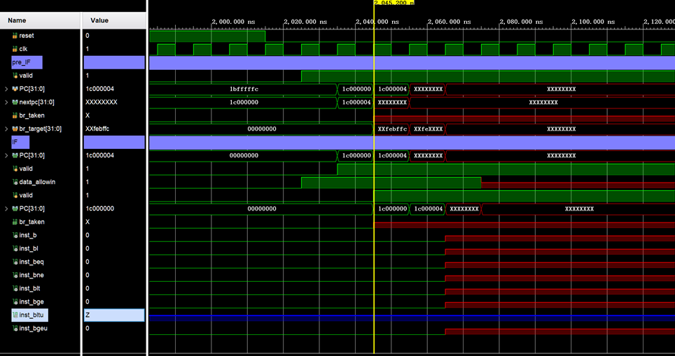
2. 分析定位过程：查看`pc=0x1c000004`的这条指令的类型。结果发现，译码阶段后生成的指令识别信号中，`inst_bitu`信号始终为高阻态"Z"。说明这个信号的连接有问题，从而导致`br_taken`等信号无法生成，导致流水线阻塞。\
&emsp;&emsp; 检查RTL代码，发现在对指令译码时，将`inst_blt`信号写成了`inst_slt`，导致`inst_blt`信号在声明后没有赋值，而`inst_slt`信号则被赋值了两次。\
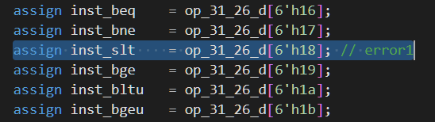
3. 错误原因：`inst_blt`信号在译码时信号名写错了。

### error 2
1. 错误现象：1132157ns时，`debug_wb_pc`，`debug_wb_rf_wnum`和`debug_wb_rf_wdata`都不符合金标准。\
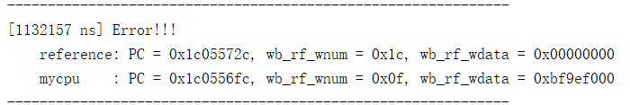\
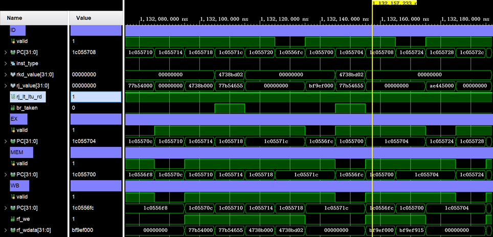
2. 分析定位过程：出错指令`pc=0x1c0556fc`，这是一条lu12i指令，而在它前面进入流水线是一条转移指令，很有可能是转移指令跳转出错了。这条转移指令`pc=0x1c05571c`，是一条blt指令。在test.S的汇编代码中找到这条指令如下。\
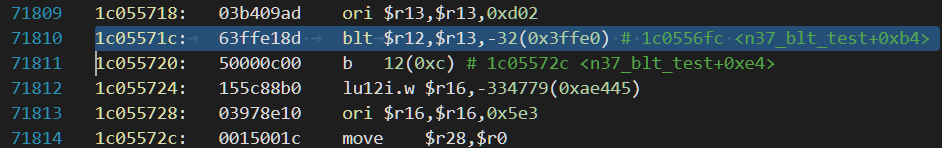\
&emsp;&emsp;它需要比较GR[12]和GR[13]的大小，来判断是否需要跳转。查看这条指令在译码阶段的行为，发现br_taken被拉高了，GR[12] < GR[13] (有符号数)。但是我们继续查看发现，两个比较的数`rj_value=0x4738bd02`，`rkd_value=0x77b54655`。显然`rj_value > 0 > rkd_value`。说明对两个操作数的大小判断逻辑出现了错误。\
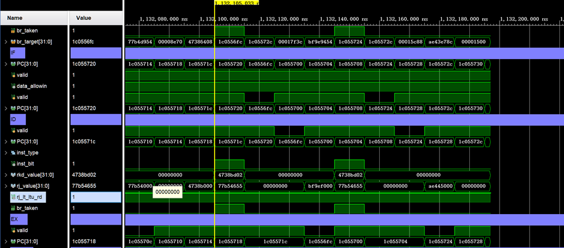\
&emsp;&emsp;检查译码阶段添加的比较器，发现slt等指令比较应该做减法，而在比较器中却漏掉了对`src2`的按位取反操作。\
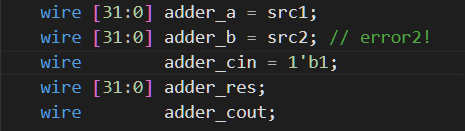
3. 错误原因：比较器的减法逻辑错误。

### error 3
1. 错误现象：1169197ns时，`debug_wb_pc`，`debug_wb_rf_wnum`和`debug_wb_rf_wdata`都不符合金标准。\
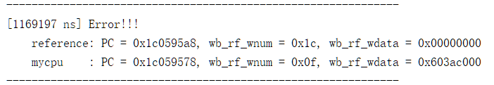\
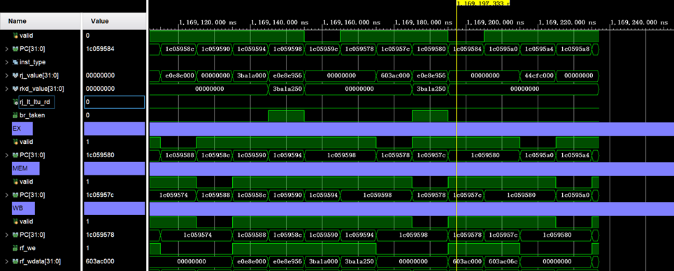\
2. 分析定位过程: 查看波形发现储蓄哦质量前一条指令是一条`bge`跳转指令，`pc=0x1c059598`。由于出错指令pc就错了，所以很有可能还是跳转判断出错。在test.S中找到这条指令如下：\

&emsp;&emsp;这条`bge`指令同样是比较GR[12]和GR[13] (带符号)的大小。再查看译码时的数据和信号，发现译码得到的`rj_value=0xe0e8e956`，`rkd_value=0x3ba1a259`，`rj_value < 0 < rkd_value`，所以应该不跳转。但是ID阶段却拉高了`be_taken`信号。
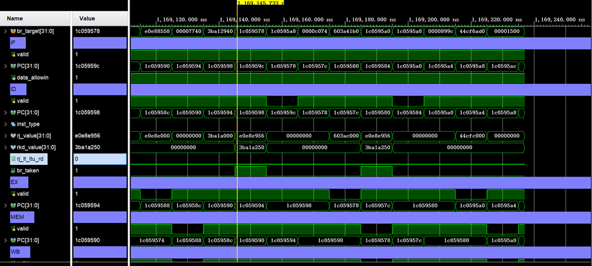\
&emsp;&emsp;回过头去看RTL代码，发现传给比较器comparator_32的信号中，有一个用来判断是否为有符号数的信号`sign`，但我只考虑了`blt`指令是有符号数，遗漏了`bge`指令，导致这里做了无符号数的比较。
3. 错误原因：比较器有符号数/无符号数判断错误。

### error 4
1. 错误现象：1356847ns时，写回数据`debug_wb_rf_wdata`出错。\
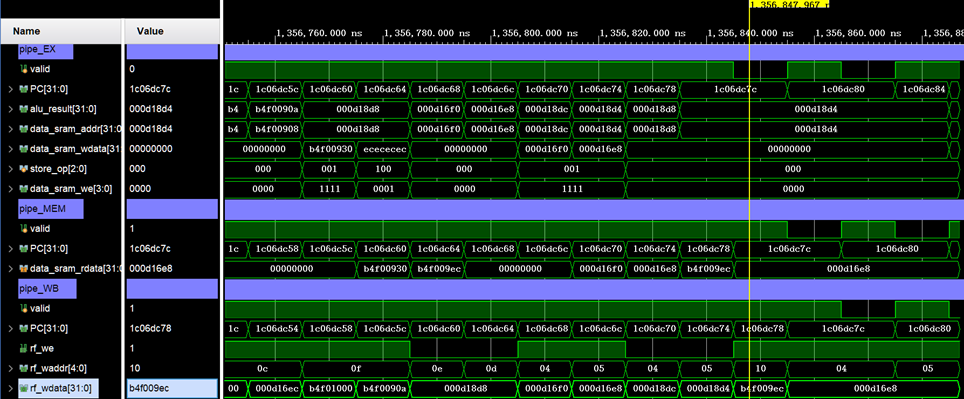
2. 分析定位过程：查看波形发现出错指令时一条`ld.w`指令，写回数据来自于内存读数据`data_sram_rdata`，而在MEM流水级返回的内存读数据`data_sram_rdata = 0xb4f009ec`就错了。这样就有2种出错可能：第一种是这条load指令的内存读地址`data_sram_addr`计算错了，第二种则是这条指令并没有出错，而是之前某一条store指令恰好写入了同样的内存地址，并且写入的数据是错的。\
&emsp;&emsp;我们先查看这条load指令的内存读地址计算。load指令的内存读地址应该是`GR[rj]+sext32(si12)`。经过检查，发现并没有出现问题，`data_sram_addr = 0x000d18d8`。\
&emsp;&emsp;于是我们就需要考虑第二种出错情况。首先我们利用波形的搜索功能，查找`data_sram_addr = 0x000d18d8`的位置。果然，在这条load指令前面非常近的位置，就有2条store指令，它们的`data_sram_addr = 0x000d18d8`，并且就是它们向内存中写入了`0xb4f009ec`。那说明这两条store指令写入数据的生成可能有问题。\
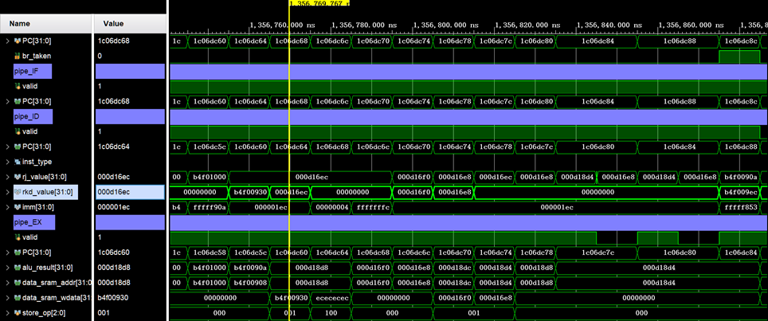\
&emsp;&emsp;查看test.S文件，发现这两条store指令写入内存的数据分别应该来自GR[14]和GR[13]。\
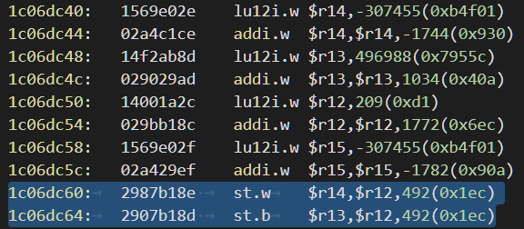\
&emsp;&emsp;我们再往前找GR[13]最近一次被写入的指令，是`pc=0x1c06dc4c`的这条`addi.w`指令。在波形中可以看到，这条指令在写回阶段将数据`0x7955c40a`写入了13号寄存器。\
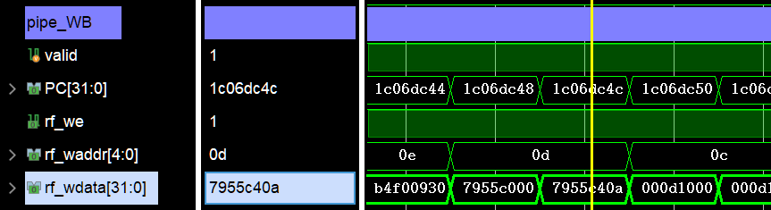\
&emsp;&emsp;但是我们在回过去看store指令，问题终于出现了：第二条store指令的`rkd_value = 0x000d16ec`，也就是说它从GR[13]中读出的数据竟然不是刚写入的`0x7955c40a`，这也导致了写入内存的数据最后一个字节为`ec`而不是`0a`。\
&emsp;&emsp;最后回到RTL代码中，检查store指令的读寄存器逻辑。发现`src_reg_is_rd`信号的赋值忘记把新增加的`st.d`等store指令加上去了，导致这条store指令的读寄存器地址变成了`rk`。\
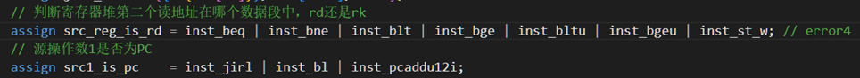
3. 错误原因：`src_reg_is_rd`信号赋值漏掉了新增的store指令。