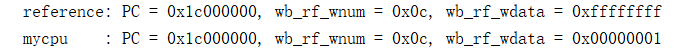
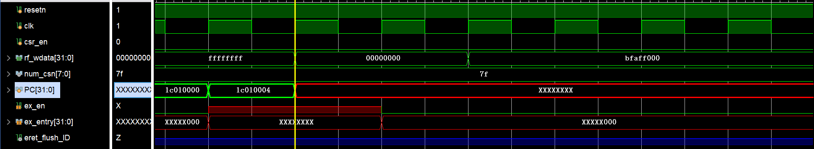
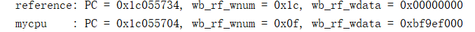
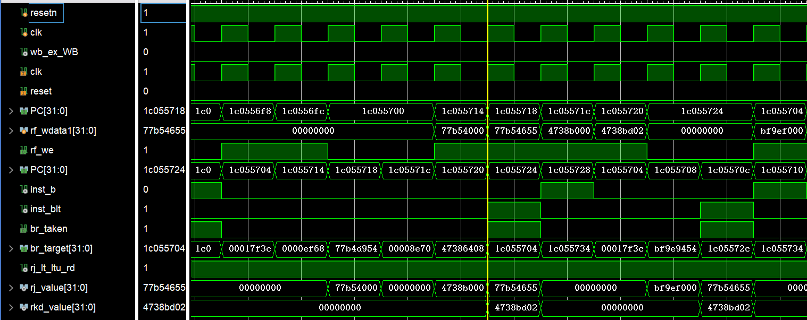
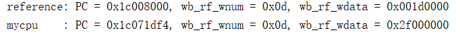
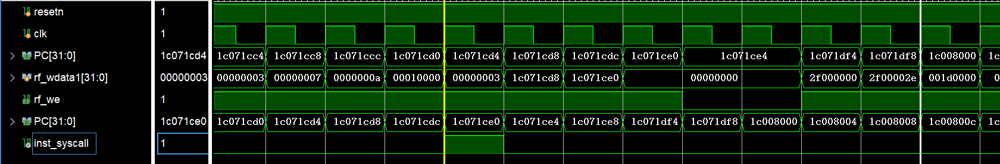
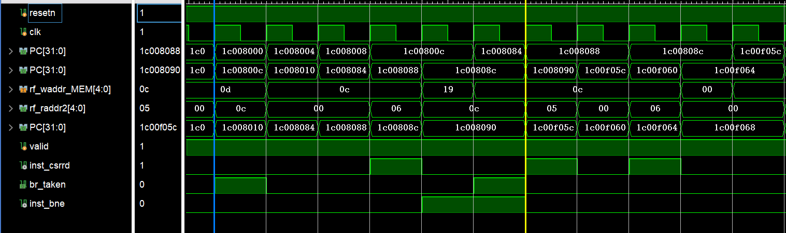
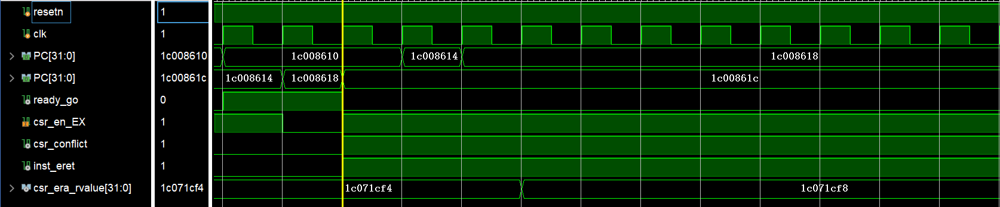

# 实验12
## 异常处理开始的处理工作
1. 保存异常的类型、触发异常的指令的 PC 等供异常处理程序使用的信息。
2. 硬件需要跳转到异常处理程序的入口执行，
3. 保证跳转到异常入口后，处理器处于高特权等级。

## 状态控制寄存器（无特殊说明均为32位）
> CRMD、PRMD、ECFG、ESTAT、ERA、BADV、EENTRY、SAVE0~3、TID、TCFG、TVAL、TICLR
* CRMD：决定处理器核当前所处的特权等级、全局中断使能、监视点使能、地址翻译模式
* PRMD：当触发例外时，除特殊情况，处理器核会将CRMD中的特权等级、全局中断使能、监视点使能保存在此寄存器中，例外返回时用它来恢复现场。
* ECFG(例外配置)：控制中断和例外的入口计算方式和各中断的局部使能位。
* ESTAT：记录例外的状态信息，触发例外的1、2级编码，以及各中断的状态。附带**例外编码表 7.4.6**
* ERA(例外程序返回地址)：记录例外处理后的返回地址，硬件需将触发例外的PC存在此处。
* BADV：当触发地址错误的相关例外时，记录出错的虚地址。
* EENTRY：用于配置处理例外和中断的入口地址。
* SAVE0~3：用于给系统软件暂存数据，只能使用csr指令访问，这里实现4个。
* TID(定时器编号)：处理器中的定时器均有一个编号，由软件配置在此寄存器中。
* TCFG(定时器配置)：软件配置定时器的借口，包括：定时器使能、循环控制位（为1时定时器减到零会再次将置为初始值）、自减的初始值。
* TVAL(定时器数值)：软件通过此寄存器读取定时器当前计数值，减为0时设置起中断信号
* TICLR：软件通过改变此寄存器值来清除定时器置起的定时中断信号。
  
控制寄存器 | csr_num | 特殊位 | mask  
:-: | :-: | :-: | :-:
CRMD | 0x0 | PLV | 1:0
 | | | IE | 2
PRMD | 0x1 | PPLV | 1:0
 | | | PIE | 2
ECFG   | 0x4 | LIE | 12:0
ESTAT  | 0x5 | CSR_ESTAT_IS10 | 1:0

ERA    | 0x6
BADV   | 0x7
EENTRY | 0xc
SAVEn  | 0x30+n
TID    | 0x40
TCFG   | 0x41
TVAL   | 0x42
TICLR  | 0x43


  
## 异常
### 中断 INT  
  包括 8 个硬中断、2 个软中断和 1 个定时器中断。  
  >* 硬中断: 信号来自核外的设备或中断控制器，ESTAT 控制状态寄存器 IS域的 9..2 这八位直接对中断输入引脚的信号采样。  
  >* 软件中断：由软件来设置的，通过 CSR 写指令对 ESTAT 状态控制寄存器 IS 域的 1..0 这两位写 1 或写 0，来完成两个软件中断的置起和撤销。
  >* 定时器中断：记录在 ESTAT 控制状态寄存器 IS 域的第 11 位  
  >* 局部使能：ECFG 控制寄存器的 LIE域的 11, 9..0 位
  >* 全局使能：CRMD 控制状态寄存器的 IE位  

  处理器核内部判定接收到中断的标志信号 has_int的赋值逻辑：
  ``` 
  assign has_int = ((csr_estat_is[12:0] & csr_ecfg_lie[12:0]) != 13'b0) && (csr_crmd_ie == 1'b1);
  ```

* 异常处理逻辑   
将异步的中断事件动态地标记在译码级的指令上，表示这条指令的异常是中断异常，此后使用普通异常的处理模式对这条指令进行处理。

### 定时器设置
>* 定时器的软件配置集中在 TCFG（Timer Config）控制状态寄存器
>* 定时器的时钟采用处理器核流水线的时钟
>* 定时器当前的计数值仅可以通过读取 TVAL 状态寄存器近
似3获得
>* 当定时器倒计时到 0 时，硬件将 ESTAT 控制状态寄存器 IS 域的第 11 位置 1，软件通过对 TICLR 控制寄存器的 CLR 位写 1 将 ESTAT 控制状态寄存器 IS 域的第 11 位清 0。  

ESTAT 控制状态寄存器 IS 域的第 11 位赋值逻辑：
```
always @(posedge clock) begin
    if (csr_tcfg_en && timer_cnt[31:0]==32'b0)
        csr_estat_is[11] <= 1'b1;
    else if (csr_we && csr_num==`CSR_TICLR && csr_wmask[`CSR_TICLR_CLR] && csr_wvalue[`CSR_TICLR_CLR])
    csr_estat_is[11] <= 1'b0;
end
```
### 取指地址错 ADEF  
   * 指令的 PC 违反字对齐时（地址最低两比特为全 0）将触发取指地址错误异常。
>* 错误的 PC 值将被硬件记录在 BADV 控制状态寄存器中。
>* 异常返回地址的 ERA 控制状态寄存器中会记录出错的 PC。不过意义不大  

* 异常处理逻辑  
在 pre-IF 级就进行这一判断，对取指所用的 PC 的最低两位进行判断，如果不是 2’b00 的话，则置起取指地址错异常标志。  
此取指地址不应该再发起请求

### 地址非对齐异常 ALE  
   * 仅针对 load、store 这类访存指令。地址最低两位不为全 0 时，触发地址非对齐异常。
>* 出错的访存 “虚” 地址将被硬件记录在 BADV 控制状态寄存器中
* 异常处理逻辑 
  在发起访存请求的 EXE 级判断，当访存地址出现非对齐情况时，则置起地址非对齐异常标志。并停止用此地址发起访存请求。
  
### 指令不存在异常 INE
   当取回的指令码不属于任何一条已实现5的指令时，将触发指令不存在异常  
   在译码阶段判断

### 系统调用 SYS 和断点异常 BRK  
   当执行 SYSCALL 指令时触发系统调用异常，当执行 BREAK 指令时触发断点异常  
   译码时发现这两个指令就设置起异常

### 响应异常后硬件的一般处理过程  
   触发例外时：
>* 将 CRMD 的 PLV、IE 分别保存到 PRMD 的 PPLV、PIE 中，然后将二者设置为0。
>* 对于支持Watch指令的操作一下WE位
>* 将触发例外指令的 PC 值记录到 ERA
>* 跳转到例外入口取指

   例外返回时：
>* 恢复PLV、IE值
>* 操作WE（Watch时）
>* 跳转到ERA处取指

### 实现异常处理返回指令 ERTN
**指令手册 4.2.6.1**  
格式：  
位数 | 值
  :-: | :-:
  10-31 | 0 0 0 0 0 1 1 0 0 1 0 0 1 0 0 0 0 0 1 1 1 0
  5-9 | 0
  0-4 | 0

### 实现 CSR 读写指令  

    **指令手册 4.2.2.1**  
    指令中的csr_num为14bit立即数，对应csr_num号寄存器，具体地址详见 **指令手册 7.1**
* csrrd rd, csr_num  
  将指定 CSR 的值读入 rd 中
* csrwr rd, csr_num
  将 rd 中的值写入指定 CSR 中, 将 CSR 的值写入 rd 中
* csrxchg rd, rj, csr_num
  根据rj中的掩码信息，将rd中的值写入指定CSR中。后将CSR的值写入rd中。  

格式：
  位数 | 值
  :-: | :-:
  24-31 | 0 0 0 0 0 1 0 0 
  10-23 | csr_num
  5-9 | 0，1，rj
  0-4 |rd

注：  
1. 指令读写的所有操作均在 WB 阶段完成。将所有访问控制寄存器的指令都放在同一流水级进行处理能有效防止数据冲突。
2. 省略掉读使能，异步读
3. 读到的值在 WB 阶段写入 rd，遵循一般的写寄存器规定。
   
### 实现 ertn 指令
* ertn 指令直到写回级才修改 CRMD，与此同时清空流水线并更新取指 PC。这也就是前面提到的 ertn_flush 信号的由来。
* 在每一个流水级添加寄存器保存ertn_flush信号，作为ertn的标志位
  

## 精确异常的实现
* 异常发生的判断逻辑分布在各流水级，靠近与之相关的数据通路；  
* 发现异常后将异常信息附着在指令上沿流水线一路携带下去，直至写回级才真正报出异常，此时才会根据所携带的异常信息更新控制状态寄存器；  
* 写回指令报出异常的同时，清空所有流水级缓存的状态，并将 nextPC 置为异常入口地址。
* 清空流水级缓存时，对于 *store类指令* 需特殊设置判断，位于执行级的 store 指令需要检查当前访存级和写回级、以及自己上有没有已标记为异常的指令，有的话取消访问内存。
* 每个异常单独一个标志信号的传递方式，最后在写回级编码为 Ecode 和 EsubCode 值送到 CSR 模块
* 在支持异常处理之前，处理器流水线中在访存级和写回级是不需要保存 load、store 指令完整的虚地址的。那么此处为了正确维护 BADV 的 VAddr 域，我们就需要在执行级、访存级和写回级增加与之对应的数据通路。
  
## 控制状态寄存器的实现
1. 把所有的控制状态寄存器集中到一个模块中实现，与各流水级模块处于并列地位
2. 模块接口分为用于 **指令访问的接口** 和与 **处理器核内部硬件电路逻辑直接交互的控制、状态信号接口** 两类；
3. 指令访问接口包含读使能（csr_re）7、寄存器号（csr_num）、寄存器读返回值（csr_rvalue）、
写使能（csr_we）、写掩码（csr_wmask）和写数据（csr_wvalue）；
4. 与硬件电路逻辑直接交互的接口信号视需要各自独立定义，无须再统一编码，如送往预取指
（pre-IF）流水级的异常处理入口地址 ex_entry、送往译码流水级的中断有效信号 has_int、
来自写回流水级的 ertn 指令执行的有效信号 ertn_flush、来自写回流水级的异常处理触
发信号 wb_ex 以及异常类型类型 wb_ecode、wb_esubcode 等。

### 以CSR的域为基本单位的代码实现(7.3.3.2)

## 处理控制状态寄存器相关引发的冲突
对于指令导致的写后读：
    将所有 CSR 读写指令访问 CSR 的操作放到同一级流水线处理，即WB级
对于如下情况  
|写者 |相关对象 |读者| 
|:---:|:------:|:--:|  
|csrwr 或 csrxchg | CRMD.IE、ECFG.LIE、ECFG.IS[1:0]、TCFG.En、TICLR.CLR |译码级的指令（标记中断）
|csrwr 或 csrxchg| ERA、PRMD.PPLV、PRMD.PIE |ertn|  
|ertn |CRMD.IE |译码级的指令（标记中断）|

前三者：  
判断执行、访存、写回级有没有这几种情况中的写相关对象的写者，如果有就把读者阻塞在译码级且什么都不做，不要进行中断标记，不要修改取指 PC。

第四个：
由于在译码阶段才能知道这个指令是否是ertn，单此时PC取指已经读了CRMD.PLV，并可能发出取指请求了。  
我们让 ertn 指令直到写回级才修改 CRMD，与此同时清空流水线并更新取指 PC。使用：ertn_flush 信号指示清空流水线

总体解决方案：
    译码级发现后面有csr读写指令，就使用rw_conflict信号，阻塞等待WB级完成将csr读到的结果写入寄存器。
     

## 实现其他指令
实现三条计时器相关指令rdcntvl.w、rdcntvh.w、rdcntid。  
>这里 rdcntvl.w 和 rdcntvh.w 两条指令分别读取计时器的低 32 位和高 32
位值写入到第 rd 项寄存器中。  
这里的计时器通过一个 64 位的计数器实现，复位为 0，复位结束后每个时钟周期自增 1，且该计数器软件无法修改，只能通过 rdcntvl.w 和 rdcntvh.w 指令读取。  
它是一个独立的计数器，它不是产生定时器中断时所用的那个倒计时计数器，使用流水线时钟。  
推荐在执行流水级读取

>rdcntid 指令读取的就是 TID 控制状态寄存器中的内容。  
将其读取 CSR 的操作推迟到写回级进行


## debug 问题
1. 信号名称错位
* 现象：对比波形的pc值保持在一个值不再变化
  
  
  
* 定位：查看pc的生成逻辑，发现pre-IF级的pc值在某一时刻变为不定态X，考虑pc赋值逻辑 
  ``` assign nextpc       = (ex_en) ? ex_entry : (br_taken ? br_target : seq_pc);```
  考虑可能是ex_en信号出错，发现ex_en信号出现不定态，再查看exen的赋值逻辑，发现是etrn_flush信号出现高阻态，考虑可能是etrn_flush未被正常连接。
* 原因，在模块例化时，信号连接错误，在ID模块的输出上接入了EX级的连线，导致错误
 ```.eret_flush(eret_flush_EX)```
* 修改为 ```.eret_flush(eret_flush_ID)```后，问题解决

1. 跳转指令逻辑错误
* 现象：波形停止处，pc值与金标准对应错误
  
  
* 定位：由于译码不太可能出错，考虑可能是preIF级pc值计算错误导致，进而考虑可能是跳转指令的逻辑出错。定位到ID阶段出现错误的pc处波形，发现该错误pc值是由blt指令跳转得到，进而考虑blt指令逻辑，定位到comparator模块，发现blt指令的逻辑是错误的，
* 原因：
    在跳转判断逻辑中，将减法转换成补码加法时未将减数逐位取反。
  ```wire [31:0] adder_b = ~src2;
     assign {adder_cout, adder_res} = adder_a + adder_b + adder_cin;
  ```
* 修改后，问题解决

3. syscall指令未清空流水级
   
   
* 现象：波形停止处，pc值与金标准对应错误
* 定位：观察波形得知，错误pc前一条指令是syscall指令，同时金标准对应pc值恰巧是syscall指令执行后的异常处理入口地址，考虑可能是syscall指令未清空流水级导致syscall后面的几条指令错误执行。
* 原因：syscall指令执行后未清空流水级，清空信号 flush 仅在ertn指令执行时有效。
* 修改：将 flush 信号在syscall指令执行，即异常出现时也置为1，问题解决。

4. csr指令出现写后读错误
* 现象：波形停止处，pc值与金标准对应错误
   
   
* 观察波形得知，出错pc是因为跳转指令判断错误，进而考虑跳转指令读取寄存器是否正确，进而观察到前2条指令是csr的写指令，跳转指令的读地址与处于MEM阶段的csr指令的寄存器写地址 rd 冲突，导致读数据错误。
* 原因：在csr指令实现时，使用阻塞来避免读后写冲突，本考虑复用如下原有读后写的阻塞逻辑进行实现。
```
assign rw_conflict = ((rf_raddr1 != 5'b0) | (rf_raddr2 != 5'b0)) 
                        & ((rf_raddr1 == rf_waddr_EX & rf_we_EX) | (rf_raddr2 == rf_waddr_EX & rf_we_EX) ) 
                        & *(res_from_mem_EX &csr_en_EX) 
```
但是此逻辑在实现时只为解决写寄存器数据来自内存的情况，因此只考虑EX阶段冲突，忽视了MEM阶段。
* 修改：在上述代码中加入MEM阶段判断即可，WB阶段冲突直接使用前递逻辑即可（因为WB阶段的csr指令已经拿到csr寄存器中的数据可供前递了）。
```
    assign rw_conflict = ((rf_raddr1 != 5'b0) | (rf_raddr2 != 5'b0)) 
                        & (((rf_raddr1 == rf_waddr_EX & rf_we_EX) | (rf_raddr2 == rf_waddr_EX & rf_we_EX) ) 
                        & (res_from_mem_EX | csr_en_EX)
                        | ((rf_raddr1 == rf_waddr_MEM & rf_we_MEM) | (rf_raddr2 == rf_waddr_MEM & rf_we_MEM))
                        & csr_en_MEM);
```

5. eret 指令与 阻塞问题
* 现象：eret指令出现后流水线一直阻塞，PC值不变
   
* 定位：考虑处理eret冲突的逻辑，发现标志 eret 指令时前面存在 csr读写指令，导致出现数据相关，因此将流水线阻塞，但是阻塞信号csr_conflict在此后一直拉高，考虑csr_conflict的赋值逻辑
```inst_eret & (csr_we_EX | csr_we_MEM | csr_we_WB); ```
发现是csr_we信号一直拉高导致。
* 原因：由于csr_we信号直接采样后面流水线对应的输出信号，没有考虑此信号可能是无效数据
```.csr_we_EX(csr_we_EX)```  
* 修改：将上述逻辑修改为
```.csr_we_EX(csr_we_EX & EX_valid)```
即可