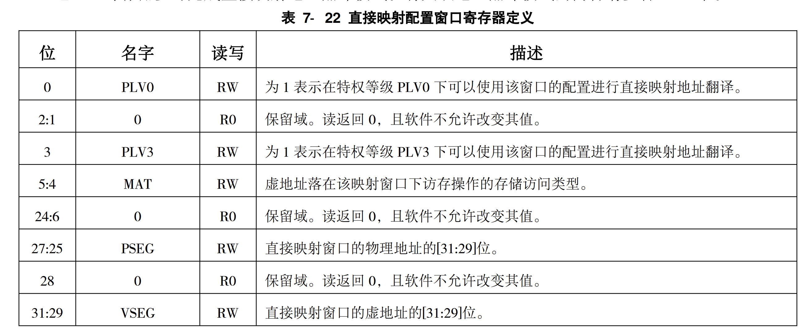
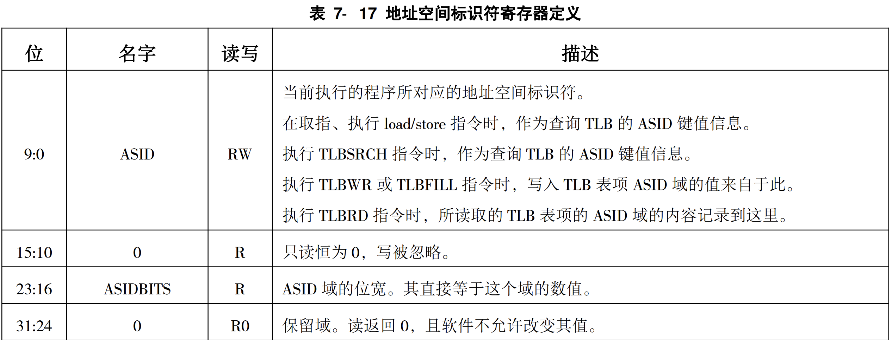
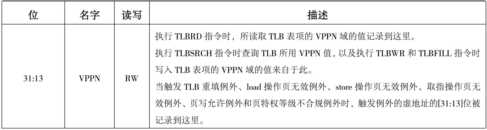
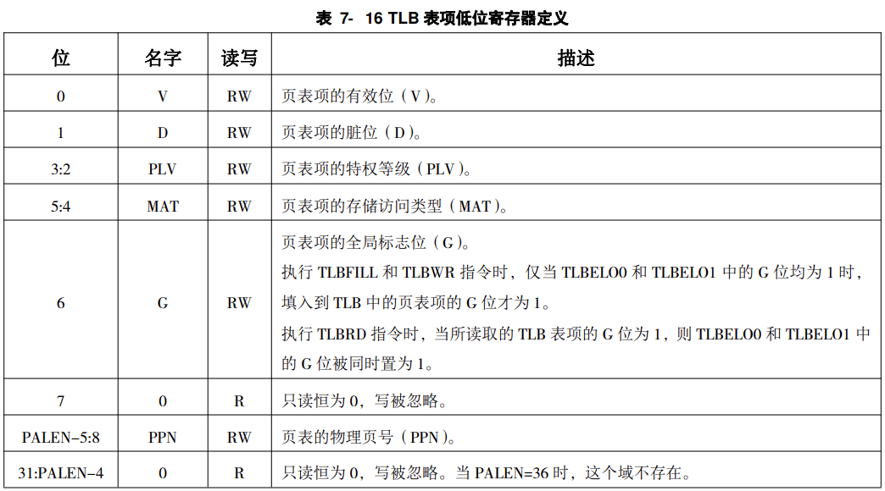
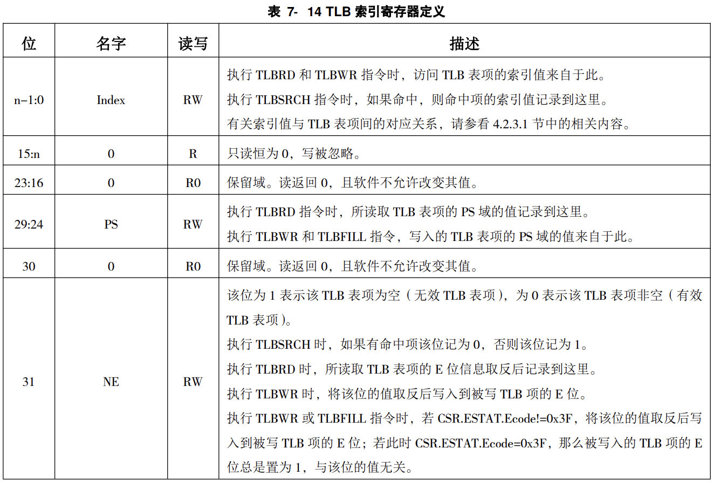

# 实验18 添加 TLB 相关指令和 CSR 寄存器
1. 直接地址翻译：物理地址默认直接等于虚拟地址的[31:0]位，
2. 页表映射翻译：直接映射、页表映射
## 一、要添加的 CSR 寄存器
### 取指、访存处的 MMU 逻辑需要使用这些 CSR 的信息，则是直接从 CSR 模块中引出来送到所需要的地方。 CSR指令访问这些 CSR 寄存器直接复用原有逻辑
1. 区分地址翻译模式的 CRMD 的 DA 和 PG 域，
DA：  
>直接地址翻译模式的使能，高有效。  
当触发 TLB 重填例外时，硬件将该域置为 1。  
当执行 ERTN 指令从例外处理程序返回时，如果 CSR.ESTAT.Ecode=0x3F，则硬件将
该域置为 0。  
DA 位和 PG 位的合法组合情况为 0、1 或 1、0，当软件配置成其它组合情况时结果不
确定.

PG：
>映射地址翻译模式的使能，高有效。  
当触发 TLB 重填例外时，硬件将该域置为 0。  
当执行 ERTN 指令从例外处理程序返回时，如果 CSR.ESTAT.Ecode=0x3F，则硬件将
该域置为 1。  
PG 位和 DA 位的合法组合情况为 0、1 或 1、0，当软件配置成其它组合情况时结果不
确定   

2. 直接映射地址翻译模式所用的 DMW0 和 DMW1，  
直接映射：
* 翻译地址时将优先看其能否按照直接映射模式进行翻译，无法进行后再按照页表映射模式进行翻译  

>每一个直接映射配置窗口可以配置一个 $2^29$ 字节固定大小的虚拟地址空间。
当虚地址命中某个有效的直接映射配置窗口时，其物理地址直接等于虚地址的[28:0]位拼接上该映射窗口所
配置的物理地址高位。  
命中的判断方式是：虚地址的最高 3 位（[31:29]位）与配置窗口寄存器中的[31:29]  
相等，且当前特权等级在该配置窗口中被允许。

DMW0：


3. TLB 读写查找相关的 ASID、TLBEHI、TLBELO0、TLBELO1 和 TLBIDX。  
ASID(TLB 索引):
* 该寄存器中包含了用于访存操作和 TLB 指令的地址空间


TLBEHI(表项高位):
* 该寄存器中包含了TLB 指令操作时与 TLB 表项高位部分虚页号相关的信息。


TLBELO0(表项低位0):
* TLBELO0 和 TLBELO1 两个寄存器包含了 TLB 指令操作时 TLB 表项低位部分物理页号等相关的信息。  
* 偶数页信息在 TLBELO0 中，奇数页信息在 TLBELO1 中。


TLBIDX
* 该寄存器包含 TLB 指令操作 TLB 时相关的索引值等信息。
* 该寄存器还包含 TLB 指令操作时与 TLB 表项中 PS、E 域相关的信息



4. CSR 相关冲突的处理
* CRMD 的 DA 和 PG、DMW0、DMW1 和 ASID 都将直接影响到pre-IF 级的取指请求
只要发现流水线中存在可能导致冲突的 CSR 指令，就将该指令后取进流水线的所有指令都设置上一个重取标
志；带有重取标志的指令就如同被标记了异常一样，即它自己不能产生任何执行效果，同时会阻
塞流水线中在它后面的指令产生执行效果；带有重取标志的指令到达写回流水级后，将像报异常
那样清空流水线。只不过它并不是真正的异常，所以不会修改任何 CSR，也不会提升处理器的特
权等级，并且此时 pre-IF 级更新的 nextPC 是出发重取指异常的那条指令的 PC，而不是任何异
常的入口地址。


2. 在 CPU 中增加的指令
1. TLBSRCH(在EX级实现)
描述：
>输入复用 s_vppn 和 s_asid，输出复用已有的 s_found。除此而外还需要一个额外的
s_index 输出，用于记录命中在第几项，其信息用于填入到 CSR.TLBIDX 中。
如果有命中项，那么将命中项的索引值写入到CSR.TLBIDX 的 Index 域，同时将 CSR.TLBIDX 的 NE 位置为 0；  
如果没有命中项，那么将 CSR.TLBIDX NE 位置为 1。

* 复用访存指令的 TLB 查找端口并在 EX 级发起查找请求是最合适的。 然后要修改CSR的数据放到WB集进行修改。

* 问题1:
TLBSRCH 指令的待查找内容是来自 CSR.ASID 和 CSR.TLBEHI 的，但它们会被写回级的 CSRWR、CSRXCHG 或 TLBRD 指令修改。如果 TLBSRCH 指令在 EX 级的时候，有一条修改 CSR.ASID 或
CSR.TLBEHI 的 CSR 指令或 TLBRD 指令恰好在 MEM 级，那么直接用 CSR 模块中 ASID 和
TLBEHI 的值就会出现问题。
解决方法：采用阻塞的方式解决此问题，如果有要写CSR寄存器的指令，直接阻塞TLBSRCH指令。
**已解决，ID级csr_rw_conflict机制，后面有csr写指令就会将该位阻塞掉**

* 问题2:
TLBSRCH 指令要查找的 TLB 可能会被 TLBWR、TLBFILL 和 INVTLB 指令更新，后面会看到这些更新并不都发生在 EX 级，因而不加处理也有可能出现问题。

2. TLBWR(在WB级实现，WB级只提供tlbwr信号，csr中的信息直接连到tlb上，不再传入WB模块中)
描述：  
> TLBWR 指令将 TLB 相关 CSR 中所存放的页表项信息写入到 TLB 的指定项。  
> 被填入的页表项信息来自于 CSR.TLBEHI、CSR.TLBELO0、CSR.TLBELO1 和 CSR.TLBIDX.PS。  
> 若此时 CSR.ESTAT.Ecode=0x3F，即处于 TLB 重填例外处理过程中，那么 TLB 中总是填入一个有效项（即 TLB 项的 E 位为 1）。  
> 否则的话，就需要看 CSR.TLBIDX.NE 位的值。此时如果 CSR.TLBIDX.NE=1，那么 TLB 中会被填入一个无效 TLB 项；仅当 CSR.TLBIDX.NE=0 时，TLB 中才会被填入一个有效 TLB 项。
> 执行 TLBWR 时，页表项写入 TLB 的位置是由 CSR.TLBIDX 的 Index 域的值指定的。
> 执行 TLBFILL 时，页表项被填入到 TLB 的哪一项，是由硬件随机选择的(实现时用一个累加器，每次加1，作为填入的Index域)。

* 让 TLBWR 和 TLBFILL 指令在写回级写 TLB 是合适的，因为此时读取的 CSR 值都是正确的。
* 问题：
由于所有指令的取指和访存指令的访存都有可能查找 TLB2用于虚实地址转换，而 TLBWR 和 TLBFILL 指令则会更新 TLB 的内容，因此这两者之间构成了围绕 TLB 的写后读相关。

解决方法：给后续所有指令标记重取标志的方式来处理，可以参考etrn等指令的处理方式。


3. TLBRD
描述：
> 将 CSR.TLBIDX 的 Index 域的值作为索引值去读取 TLB 中的指定项。  
如果指定位置处是一个有效 TLB项，那么将该 TLB 项的页表信息写入到 CSR.TLBEHI、CSR.TLBELO0、CSR.TLBELO1 和 CSR.TLBIDX.PS中，且将 CSR.TLBIDX 的 NE 位置为 0；  
如果指定位置处是一个无效 TLB 项，需将 CSR.TLBIDX 的 NE 位置为 1，且将 CSR.ASID.ASID、CSR.TLBEHI、CSR.TLBELO0、CSR.TLBELO1 和 CSR.TLBIDX.PS 全置为0。

* TLBRD 指令在写回级读 TLB 并更新相关 CSR 是最合适的。
* 问题：
由于 TLBRD 指令会更新 CSR.ASID 的 ASID 域，但是所有指令的取指和访存指令
的访存都有可能读取 CSR.ASID 的 ASID 域去查找 TLB
解决方法：解决的方法也与 TLBWR 和 TLBFILL 指令一样，采取给后续指令标记重取标志的方式。

4. INVTLB
描述：
> INVTLB 指令用于无效 TLB 中的内容，以维持 TLB 与内存之间页表数据的一致性。   
指令的三个源操作数中，op 是 5 比特立即数，用于指示操作类型。    
通用寄存器 rj 的[9:0]位存放无效操作所需的 ASID 信息（称为“寄存器指定 ASID”），其余比特必须填0。当 op 所指示的操作不需要 ASID 时，应将通用寄存器 rj 设置为 r0。  
通用寄存器 rk 中用于存放无效操作所需的虚拟地址信息（称为“寄存器指定 VA”）。当 op 所指示的操
作不需要虚拟地址信息时，应将通用寄存器 rk 设置为 r0。  

* 其在 EX 级发起 TLB 查询的请求是比较合适的，复用 TLB 模块中已有的查找逻辑
* INVTLB 指令会更新 TLB 的内容，且这个更新不会早于 EX 级，所以它也需要像
TLBWR 和 TLBFILL 指令那样，通过给后续指令标记重取标志的方式来解决其与后续指令的取
指和访存指令的访存操作之间的 TLB 写后读相关冲突。


debug
1. ID——524:assign csr_en = inst_csr & inst_tlbsrch & inst_tlbrd;
｜写成&导致csr_en一直为0

2. csr_num的值一直为0导致csr写入出现错误，
ID-522: assign csr_num = (csr_num_special == 14'b0)? csr_num_special : inst[23:10];

3. csr--192: csr_crmd_pg <= 1'b0;
csr_crmd_pg 在reset时设置值应该为1。
发现过程，没有发现对应的csr_crmd赋值的语句，因此判断可能是在reset时赋值时出错

4. flush逻辑出错
```v
assign tlb_conflict = inst_tlbwr | inst_tlbfill | inst_tlbrd | inst_invtlb |
                        (csr_we & (csr_num == `CSR_CRMD 
                        | csr_num == `CSR_DWM0 
                        | csr_num == `CSR_DWM0
                        | csr_num == `CSR_ASID
                        )) & ~tlb_flush & valid;
always @(posedge clk) begin
    if (reset) begin
        tlb_flush <= 1'b0;
    end
    else if (data_allowin && tlb_conflict) begin
        tlb_flush <= 1'b1;
    end
    else if (tlb_flush_WB) begin
        tlb_flush <= 1'b0;
    end
end
```
修改：
```v
assign tlb_conflict = (inst_tlbwr | inst_tlbfill | inst_tlbrd | inst_invtlb |
                        (csr_we & (csr_num == `CSR_CRMD 
                        | csr_num == `CSR_DWM0 
                        | csr_num == `CSR_DWM1
                        | csr_num == `CSR_ASID
                        ))) & valid;
always @(posedge clk) begin
    if (reset) begin
        tlb_flush <= 1'b0;
    end
    else if (tlb_conflict) begin
        tlb_flush <= 1'b1;
    end
    else if (tlb_flush_WB) begin
        tlb_flush <= 1'b0;
    end
end
```

问题5:
忘记给ine异常添加上新添加的几个指令，导致错误爆出异常

问题6:
invtlb指令op值不为指定的几个值时需要出现保留指令异常，此功能未实现
ID: 540
wire ex_invtlb; // invtlb op 值不为0-6时，触发指令不存在异常
assign ex_invtlb =  inst_invtlb & (invtlb_op[2:0] == 3'h7 | invtlb_op[4:3] != 2'h0);


